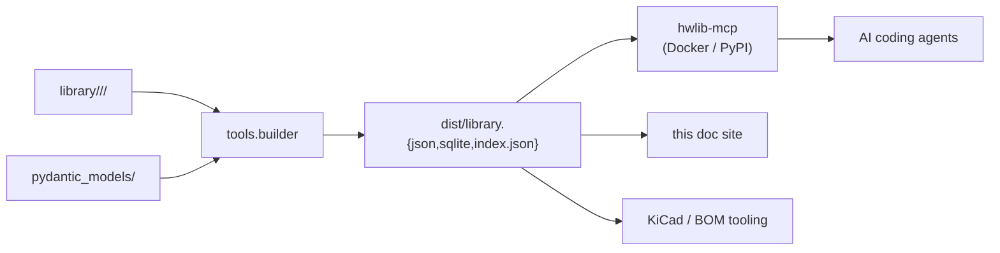

# Architecture

`hw-registry` is a curated hardware library with three consumption paths.

## Source of truth

| Path | Role | Editable? |
|---|---|---|
| `library/**/*.yaml` | canonical for **content** (the actual values per component) | ✅ yes — author here |
| `pydantic_models/` | canonical for **structure** (which fields exist, what types) | ✅ yes — model evolution lands here |
| `schemas/` | JSON Schemas generated from the models | ❌ generated; never hand-edit |
| `dist/` | built bundle (library.json, library.sqlite, index.json) | ❌ generated; never commit by hand |

`schemas/` is regenerated by `python -m tools.generate_schemas`. A pre-commit hook (`check-schemas-synced`) fails the commit if the schemas drift from the models, so the two are always in lockstep.

## The bundle

`tools.builder` consumes the YAML library and the Pydantic models, resolves `inherits_from` and `contains.ref` cross-references, and produces three artifacts in `dist/`:

- **`library.json`** — the full resolved component dataset. ~34 KB at 8 components.
- **`library.sqlite`** — the same data indexed for fast lookup. The MCP server reads this directly via stdlib `sqlite3`.
- **`index.json`** — a faceted index (counts, IDs by kind, build metadata).

The bundle is **deterministic**: byte-identical for byte-identical inputs (`SOURCE_DATE_EPOCH` is honored for SQLite metadata).

## MCP server

The `hwlib-mcp` package exposes the bundle to AI agents via the Model Context Protocol. It ships as a Python wheel and a distroless Docker image (`gcr.io/distroless/python3-debian13:nonroot`). The runtime contract:

- `HWLIB_DATA_DIR` env var points at the directory holding `library.sqlite`.
- Missing bundle → fail-fast with `exit=2` and a structured stderr message.
- HTTP mode exposes `/health` returning `{status, bundle_present, component_count, schema_version}` for orchestrator probes.

## Detailed design

The full structural blueprint with reconciliation notes, naming rules, and per-kind conventions is maintained in `docs/internal/BLUEPRINT.md`. That document is committed to the repo (audit trail of our design decisions) but excluded from this published site. Refer to it when adding new component kinds, extending model shapes, or deciding how a new field should be normalized.
