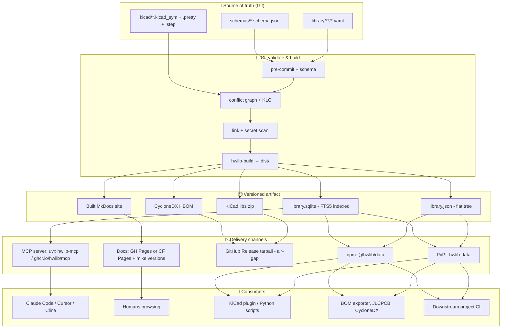
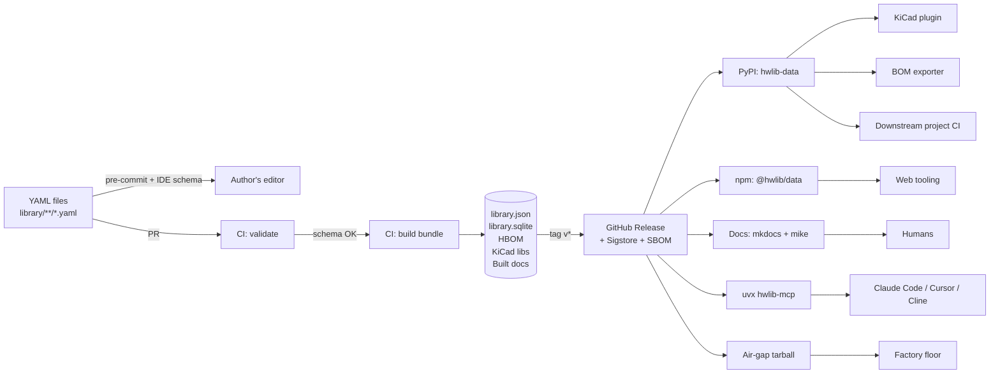
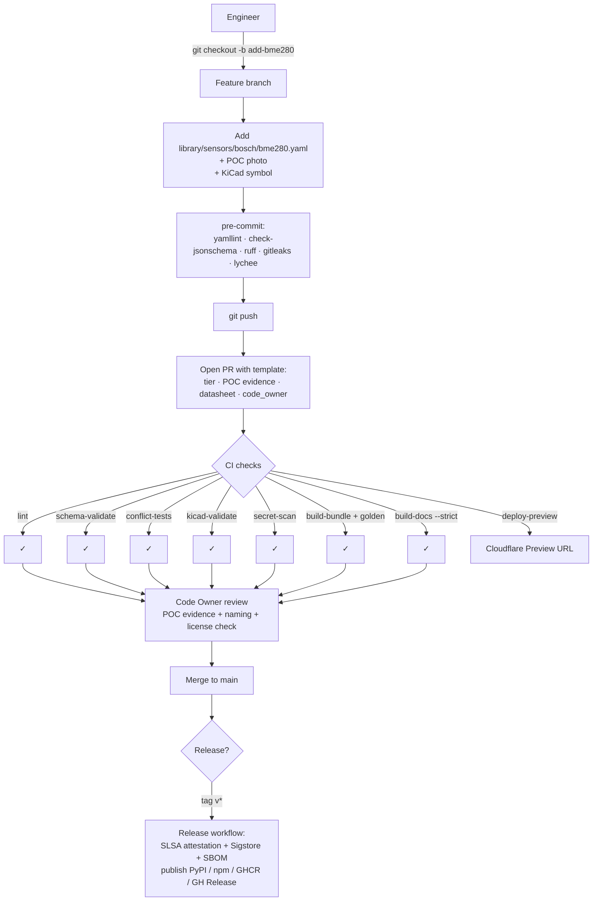

# Hardware Library Architecture: A Senior Engineer's Blueprint

> **Document status.** This is the architectural recommendation that the Claude Code prompt pack
> (`docs/internal/CLAUDE_CODE_PROMPTS.md`) was derived from. It is the **canonical source of truth
> for shape and convention**: schema layout, field ordering, what is included vs. omitted, naming
> patterns, the layered consumer architecture. When a prompt says "verbatim from blueprint section
> X.Y", this is the document being referenced.
>
> Prose here is **CC-BY-4.0** along with the rest of `docs/`. The YAML examples are **CC-BY-4.0**
> and may be lifted directly into `library/` files with attribution unnecessary inside this repo.
>
> **Living document.** When the schema or repo conventions evolve, update this blueprint in the
> same PR — divergence between blueprint and `pydantic_models/` / `library/` is itself a bug.

---

## 1. Executive summary

Build the hardware library as a **YAML-source-of-truth monorepo** validated by JSON Schema and Pydantic, with a **deterministic build step** that emits a single bundled artifact (JSON + SQLite) consumed by three downstream surfaces: an MCP server (for Claude Code/Cursor), an MkDocs Material doc site (for humans), and a Python/CLI package (for KiCad and BOM tooling). The pattern mirrors how MDN's Browser Compat Data, Home Assistant's integration manifests, and Zephyr's devicetree bindings are run — proven at scale, low operational cost, air-gap-friendly. Identity is borrowed from Devicetree (`vendor,part` `compatible` strings + bindings), pin modeling from CircuitPython (multi-alias) crossed with MicroPython STM32's two-level chip-AF × board-pinout split, electrical pin types from KiCad, discovery descriptors from Home Assistant. The result is a single Git repo where every PR runs schema validation, KiCad KLC checks, link checks, and pin-conflict detection before merging — and where adding a new component is one YAML file, one POC photo, one PR.

The non-obvious architectural commitment is that **agents, humans, and tooling never read the YAML directly** — they consume the *built* artifact. This decouples authoring ergonomics (YAML, anchors, comments) from consumption ergonomics (indexed SQLite, sparse-field JSON, MCP tools with progressive disclosure), and keeps the library performant even as it grows past 200 components.

## 2. Prior art comparison

| System | Identity model | Pin/peripheral modeling | Electrical/specs | Drivers | Discoverable | Versioned | Use-case fit |
|---|---|---|---|---|---|---|---|
| **Zephyr Devicetree + bindings** | `vendor,device` compatible string + YAML binding (best-in-class) | Pinctrl (alt-functions), `gpio-map` connectors, hierarchical buses | Limited; in driver code | Via `compatible` → driver | Build-time | No first-class versioning | **Borrow heavily**: identity, bindings, connectors |
| **CircuitPython `board`** | Board ID slug | Multi-alias pins (`IO9`/`MISO`/`D6`) — best ergonomics | None | Implicit via firmware | No | No | **Borrow**: pin aliasing |
| **MicroPython STM32 `pins.csv` + `*_af.csv`** | Board ID + MCU name | Two-level: chip AF table × board pin CSV (clean separation) | None | None | No | No | **Borrow**: chip-vs-board split |
| **PlatformIO `boards.json`** | `vendor` + board ID | None — toolchain-only | RAM/flash bounds, MCU id | `frameworks[]` | USB `hwids` | Per-platform versioning | **Borrow**: toolchain block, `hwids` |
| **Arduino `variant.h`/`pins_arduino.h`** | Variant directory | Canonical names (`SDA`,`SCL`,`LED_BUILTIN`) | None | Implicit | No | No | **Borrow**: well-known alias names |
| **ESP-IDF Kconfig + esp-bsp** | Per-component | None at hardware level | Capability symbols (`SOC_*`) | Via Kconfig | No | No | **Borrow**: capability flags |
| **Wokwi `chip.json`/`diagram.json`** | `vendor-part` slug | Ordered pin array, netlist-style connections | None | None | Centrally curated | No | **Borrow**: ordered-pin visualization |
| **KiCad `.kicad_sym` / `.pretty`** | `lib_nickname:name` | Per-pin electrical type enum (`power_in`, `bidirectional`, …) | None | None | Sym/fp tables | Format-versioned | **Borrow**: electrical pin type enum, `Footprint`/`Datasheet` properties |
| **Fritzing `.fzp`** | `moduleId` | `family`+`variant`+`properties` | None | None | No | No | Borrow taxonomy concept; otherwise dated |
| **SnapEDA / Ultra Lib / SamacSys** | MPN | Symbol+footprint+3D | Distributor parametrics only | None | API/web | Per-vendor | **Use as ingestion**, not source of truth |
| **Octopart / Nexar GraphQL** | MPN, manufacturer | None | Distributor pricing/lifecycle/lead time | None | Yes | N/A | **Use as nightly cache**, not authoring |
| **JEP30 / IPC-7351** | Manufacturer + MPN | IPC-7351 land-pattern names | Bounded | None | No | Standardized | **Borrow**: IPC-7351 package strings |
| **CycloneDX HBOM (ECMA-424)** | `cpe`/`purl`/MPN | Component dependency graph | License/lifecycle | N/A | Standardized | Schema-versioned | **Use as export format** |
| **Home Assistant manifest** | `domain` slug | Discovery descriptors (USB VID/PID, BLE, mDNS) | None | `requirements[]` | First-class | `quality_scale` tier | **Borrow**: discovery hooks, codeowners, quality tiers |
| **OSHWA repos (Adafruit/SparkFun)** | Per-product repo | KiCad/Eagle CAD | None | None | Vendor-specific | Repo tag | **Borrow**: KiCad org conventions, datasheet-link discipline |
| **IP-XACT (IEEE 1685-2022)** | VLNV (Vendor/Library/Name/Version) | Bus interfaces, register maps | Yes | Yes | Standardized | First-class | **Borrow**: VLNV identity tuple |

**Net of the survey**: no single ecosystem covers boards + modules + sensors + drivers + KiCad refs + BOM + discovery + AI consumption. Compose: Devicetree-style identity, CircuitPython aliasing, MicroPython two-level pin model, KiCad pin types, Home Assistant discovery + tiers, IPC-7351 packages, CycloneDX export.

## 3. Recommended schema design

**Format**: YAML with `# yaml-language-server: $schema=…` directive. JSON Schema Draft 2020-12 as the on-disk canonical schema, **generated from Pydantic v2 models** so authoring happens in typed Python and validation runs identically in IDE, pre-commit, and CI.

**Identity**: slug = relative path = `<kind>/<vendor>/<part>` (e.g. `sensors/sensirion/sht41`). Vendor slugs from Zephyr's `vendor-prefixes.txt`. The internal `id:` field must equal the path slug; CI enforces it. SemVer with hardware semantics: MAJOR = pin/electrically-incompatible, MINOR = behavior change, PATCH = errata/silkscreen. ECNs are first-class objects in the file.

**Common base** (`common/identifiable.json`):

```json
{
  "$schema": "https://json-schema.org/draft/2020-12/schema",
  "type": "object",
  "required": ["apiVersion","kind","id","revision"],
  "properties": {
    "apiVersion": {"const": "hwreg/v1"},
    "kind": {"enum": ["chip","module","board","sensor","connector","driver"]},
    "id":   {"type":"string","pattern":"^[a-z]+/[a-z0-9-]+/[a-z0-9-]+$"},
    "revision": {"type":"string","pattern":"^\\d+\\.\\d+\\.\\d+$"},
    "summary": {"type":"string","maxLength":120},
    "tested": {
      "type":"object",
      "required":["status","by","date"],
      "properties": {
        "status": {"enum":["stub","verified","production-tested"]},
        "by":     {"type":"string"},
        "date":   {"type":"string","format":"date"}
      }
    },
    "lifecycle": {"enum":["experimental","stable","deprecated","eol","archived"]},
    "code_owner": {"type":"string"}
  }
}
```

### 3.1 Board example — ESP32-S3-DevKitC-1

```yaml
# yaml-language-server: $schema=../../../schemas/board.schema.json
# SPDX-License-Identifier: CC-BY-4.0
apiVersion: hwreg/v1
kind: board
id: boards/espressif/esp32-s3-devkitc-1
revision: 1.1.0
summary: "ESP32-S3-WROOM-1, 8MB flash, USB-OTG, dual USB-C"
vendor: espressif
manufacturer_part_number: ESP32-S3-DevKitC-1-N8R8
description: "Official Espressif dev board with 8MB flash and 8MB octal PSRAM."
tags: [esp32, s3, wifi, ble, usb-otg, lx7]
tested: { status: production-tested, by: jane@example.com, date: 2026-02-14 }
lifecycle: stable
code_owner: "@hw-library/boards-team"
inherits_from:
  - modules/espressif/esp32-s3-wroom-1@1.0.0      # is-a (imports MCU specs)
peripherals:
  spi:  { count: 4, max_clock_mhz: 80, user_usable: 2 }
  i2c:  { count: 2, max_clock_khz: 1000 }
  uart: { count: 3, max_baud: 5000000 }
  adc:  { count: 2, channels: 20, resolution_bits: 12 }
  usb:  { count: 1, otg: true }
electrical:
  vcc:   { nominal_v: 5.0, min_v: 4.0, max_v: 5.5, source: usb-c }
  logic: { family: cmos_3v3, five_v_tolerant: false }
  power_budget_mA: 500
discovery:
  usb:
    - { vid: "303A", pid: "1001", description: "ESP32-S3 native USB" }
    - { vid: "10C4", pid: "EA60", description: "CP210x bridge to UART" }
strapping_pins: [GPIO0, GPIO3, GPIO45, GPIO46]
reserved_pins:  [GPIO19, GPIO20]   # USB D+/D-
pins:
  - id: GPIO8
    aliases: [SDA, IO8]
    package_pin: 18
    voltage_domain: vdd_io
    default: gpio
    alt_functions:
      - { function: gpio,    direction: bidir }
      - { function: i2c_sda, peripheral: i2c0, open_drain: true }
      - { function: spi_mosi,peripheral: spi2 }
      - { function: adc_in,  peripheral: adc1, channel: 7 }
  # … 44 more pins
expansion_headers:
  - name: J1
    pitch_mm: 2.54
    pins: [3V3, EN, GPIO4, GPIO5, GPIO6, GPIO7, GPIO15, GPIO16, GND]
build:
  frameworks: [arduino, espidf, zephyr, micropython]
  flash_size_mb: 8
  ram_kb: 512
  psram_mb: 8
kicad:
  symbol:    "hw-registry:ESP32-S3-DevKitC-1"
  footprint: "hw-registry:ESP32-S3-DevKitC-1"
  model_3d:  "${HWREG_3D}/Boards.3dshapes/esp32-s3-devkitc-1.step"
external_refs:
  cpe:  "cpe:2.3:h:espressif:esp32-s3-devkitc-1:v1.1:*:*:*:*:*:*:*"
  purl: "pkg:generic/espressif/[email protected]"
assets:
  datasheet:
    primary_url: https://www.espressif.com/sites/default/files/documentation/esp32-s3-devkitc-1_v1.1_schematics.pdf
    sha256: "…"
  photos:
    - { path: assets/photos/esp32-s3-devkitc-1-top.jpg, lfs: true, license: CC-BY-4.0 }
```

### 3.2 Module example — RAK3172 (with inheritance)

```yaml
apiVersion: hwreg/v1
kind: module
id: modules/rakwireless/rak3172
revision: 1.2.0
summary: "STM32WLE5JC-based LoRaWAN module, 15×15mm castellated LCC-50"
vendor: rakwireless
manufacturer_part_number: RAK3172
inherits_from:
  - chips/st/stm32wle5jc@1.0.0                  # is-a: imports SoC pin/peri capability
contains:                                       # has-a: physical sub-parts (BOM-style)
  - { ref: chips/st/stm32wle5jc, role: mcu, qty: 1 }
  - { ref: passives/tcxo-32mhz,  role: tcxo, qty: 1 }
overrides:
  electrical:
    vcc: { nominal_v: 3.3, min_v: 2.0, max_v: 3.6 }
  pins:                                         # only pins exposed on module package
    - { id: PA0, exposed_as: pin1,  alt_functions: [gpio, uart_rx] }
    - { id: PA1, exposed_as: pin2,  alt_functions: [gpio, uart_tx] }
    - { id: PA2, exposed_as: pin3,  alt_functions: [gpio, uart2_tx] }   # AT firmware port
    - { id: PA3, exposed_as: pin4,  alt_functions: [gpio, uart2_rx] }
    # … 14 more
  peripherals: { uart: { count: 2 } }
package:
  type: castellated-LCC-50
  ipc_name: "LCC50P15X15X25-50N"
  dimensions_mm: { x: 15, y: 15, z: 2.5 }
  rf_certifications: [FCC, CE, IC, KC]
firmware_options:
  - { name: rui3, default: true, at_baud: 115200, at_format: "8N1" }
  - { name: open-stm32wlxx-source, repo: "github.com/RAKWireless/RUI_v3.x" }
kicad:
  symbol:    "hw-registry:RAK3172"
  footprint: "hw-registry:RAK3172_LCC-50"
  model_3d:  "${HWREG_3D}/Modules.3dshapes/rak3172.step"
```

### 3.3 Sensor example — Sensirion SHT41 with constraints

```yaml
apiVersion: hwreg/v1
kind: sensor
id: sensors/sensirion/sht41
revision: 1.0.0
summary: "I2C T/RH sensor, addr 0x44, ±0.2 °C / ±1.8 %RH, DFN-4 1.5×1.5mm"
vendor: sensirion
manufacturer_part_number: SHT41-AD1B
tested: { status: production-tested, by: jane@example.com, date: 2026-01-08 }
lifecycle: stable
code_owner: "@hw-library/sensors-team"
electrical:
  vcc:           { nominal_v: 3.3, min_v: 1.08, max_v: 3.6 }
  current_draw:  { typ_active_mA: 0.4, sleep_uA: 0.08 }
  logic:         { family: cmos_3v3, five_v_tolerant: false }
interface:
  type: i2c
  speed_max_khz: 1000
constraints:
  i2c:
    address: 0x44
    address_pin_options: [0x44, 0x45]    # SHT41-A=0x44, SHT41-B=0x45
    requires_pullups_ohms: 10000
  interrupt: { required: false }
  power:
    min_startup_time_ms: 1.0
    requires_decoupling: ["100nF X7R close to VDD"]
package:
  type: DFN-4
  ipc_name: "DFN40P150X150X50-4N"
  dimensions_mm: { x: 1.5, y: 1.5, z: 0.5 }
drivers: [drivers/sensirion-sht41]    # cross-ref to driver registry entry
kicad:
  symbol:    "hw-registry:SHT41"
  footprint: "hw-registry:Sensirion_DFN-4-1EP_1.5x1.5mm"
  model_3d:  "${HWREG_3D}/Sensors.3dshapes/SHT41.step"
external_refs:
  cpe:  "cpe:2.3:h:sensirion:sht41:-:*:*:*:*:*:*:*"
  purl: "pkg:generic/sensirion/sht41"
assets:
  datasheet:
    primary_url: https://sensirion.com/.../Sensirion_HT_Datasheet_SHT4x.pdf
    archived_url: https://web.archive.org/web/2025/...
    sha256: "…"
```

### 3.4 Driver example

```yaml
apiVersion: hwreg/v1
kind: driver
id: drivers/sensirion-sht41
revision: 1.0.0
summary: "Vetted driver bindings for SHT41 across embedded frameworks"
applies_to: [sensors/sensirion/sht41]
bindings:
  - framework: esp-idf
    component: k0i05/esp_sht4x
    version_constraint: "^1.2.5"
    source: https://components.espressif.com/components/k0i05/esp_sht4x
    header: sht4x.h
    sample_call: "sht4x_get_measurement(dev_hdl, &t, &rh);"
    tested_with: "ESP-IDF 5.5"
    license: MIT
  - framework: arduino
    library: Adafruit_SHT4x
    version_constraint: ">=1.0.4"
    package_index: arduino
    tested_with: "Arduino-ESP32 3.0.1"
  - framework: zephyr
    compatible: "sensirion,sht4x"
    binding: dts/bindings/sensor/sensirion,sht4x.yaml
    kconfig: CONFIG_SHT4X
    tested_with: "Zephyr 4.0.0"
  - framework: micropython
    module: adafruit_sht4x
    install: "mip install adafruit-sht4x"
```

> **Note on driver ID namespacing.** The example above uses `drivers/sensirion-sht41` (two-segment).
> The Pydantic models adopt the **three-segment** form `drivers/sensirion/sht41` (Option A locked
> during Prompt 3 prep), to match the slug regex `^[a-z]+/[a-z0-9-]+/[a-z0-9-]+$` shared by every
> other component kind. When authoring driver YAMLs, use the three-segment form for both the `id:`
> field and any `drivers: [...]` cross-ref in sensor files.

### 3.5 Pin-conflict encoding

Constraints are validated by a graph-based system-level checker. Two YAML files compose into a *system*; the validator emits ERC-style diagnostics:

```yaml
# tests/fixtures/system_examples/lorawan-node.yaml
system:
  board: boards/espressif/esp32-s3-devkitc-1
  components:
    - { ref: sensors/sensirion/sht41,  instance: u2,
        pins: { SDA: GPIO8, SCL: GPIO9 } }
    - { ref: modules/rakwireless/rak3172, instance: u3,
        pins: { uart2_tx: GPIO17, uart2_rx: GPIO18, RESET: GPIO16 } }
```

The validator graph:

- Nodes: `PhysicalPin`, `LogicalSignal`, `PeripheralInstance`, `ComponentInstance`.
- Edges: `uses(component,pin,purpose)`, `alt_function(pin,peri,fn)`, `i2c_address(component,addr)`, `voltage_requires(component,domain,min,max)`.
- Rules (severity ERROR unless noted): GPIO double-use; I²C address clash on shared bus; voltage mismatch when `!five_v_tolerant`; missing required interrupt pin; pin assigned a function not in its `alt_functions`; strapping-pin used for forbidden direction (WARN); current-budget exceeded (WARN); missing `requires_pullups_ohms` on I²C bus (WARN). Output as SARIF for IDE integration.

## 4. Recommended repository structure

```
hw-registry/
├── README.md
├── LICENSE                              # CC-BY-4.0 prose / MIT code (SPDX expression)
├── .gitattributes                       # LFS rules (*.pdf *.step *.stp *.wrl *.png *.jpg)
├── .gitleaks.toml                       # secret-scan allowlist for fixtures
├── .pre-commit-config.yaml
├── .github/
│   ├── workflows/{ci.yml,release.yml,nightly.yml}
│   ├── CODEOWNERS                       # directory-scoped, /.github/ self-owned
│   ├── PULL_REQUEST_TEMPLATE.md
│   └── ISSUE_TEMPLATE/{component-bug.yml,new-component-request.yml,deprecation-notice.yml}
├── pyproject.toml                       # pydantic, jsonschema, mkdocs-*, kiutils, fastmcp
├── pydantic_models/                     # source of truth for schemas
│   ├── board.py module.py chip.py sensor.py connector.py driver.py
│   └── common/{pin.py,electrical.py,assets.py,ecn.py}
├── schemas/                             # GENERATED Draft 2020-12 JSON schemas
│   ├── board.schema.json module.schema.json sensor.schema.json …
│   └── common/{pin,electrical,identifiable,assets}.schema.json
├── library/                             # ← THE DATA, one YAML per component
│   ├── chips/{espressif/esp32-s3.yaml, st/stm32wle5jc.yaml, …}
│   ├── modules/{espressif/esp32-s3-wroom-1.yaml, rakwireless/rak3172.yaml, …}
│   ├── boards/{espressif/esp32-s3-devkitc-1.yaml, raspberrypi/pico-2.yaml, adafruit/feather-esp32-s3.yaml}
│   ├── sensors/{sensirion/sht41.yaml, bosch/bme280.yaml, ti/ads1115.yaml}
│   ├── connectors/{molex/pico-blade-1x4.yaml, jst/sh-1x4.yaml}
│   └── drivers/{sensirion-sht41.yaml, bosch-bme280.yaml, ti-ads1115.yaml}
├── kicad/                               # KiCad libs in same repo
│   ├── hw-registry.kicad_sym
│   ├── hw-registry.pretty/*.kicad_mod
│   ├── hw-registry.3dshapes/*.step      # LFS
│   └── sym-lib-table fp-lib-table       # project-scoped, env-var paths
├── assets/
│   ├── photos/                          # LFS
│   ├── pinouts/                         # generated SVGs (also committed)
│   └── datasheets/                      # private mirror only; gitignored unless license permits
├── tests/
│   ├── conftest.py
│   ├── test_schema.py                   # every YAML validates
│   ├── test_conflicts.py                # graph-based system checks
│   ├── test_klc.py                      # KiCad symbol/footprint convention
│   ├── golden/                          # snapshot tests for bundle output
│   └── fixtures/system_examples/
├── tools/
│   ├── builder/                         # pip-installable: emits dist/library.{json,sqlite}
│   ├── validate.py                      # custom semantic checks (slug uniqueness, ref resolution)
│   ├── render_pinout.py                 # SVG generator
│   ├── generate_bom.py                  # CycloneDX HBOM + JLCPCB CSV
│   ├── klc/                             # vendored kicad-library-utils
│   └── mcp/                             # FastMCP server reading dist/library.sqlite
├── docs/                                # MkDocs source
│   ├── mkdocs.yml requirements.txt
│   ├── index.md
│   ├── gen_component_pages.py           # mkdocs-gen-files hook
│   └── components/                      # virtual, generated at build time
└── dist/                                # CI artifact; library.json + library.sqlite + site/
```

**Key choices**: monorepo (atomic refactors, single LFS quota); category-first path = identity; KiCad libs in-tree until split is justified; assets via LFS; private datasheets gitignored.

## 5. Validation and CI pipeline

A layered funnel — cheap structural checks fail fast, expensive checks gated last. All checks runnable identically locally via `pre-commit run --all-files`.

```yaml
# .github/workflows/ci.yml (abridged)
name: ci
on: [pull_request, push]
permissions: { contents: read, pull-requests: write }
jobs:
  lint:
    runs-on: ubuntu-latest
    steps:
      - uses: actions/checkout@v4
        with: { lfs: true }
      - uses: actions/setup-python@v5
        with: { python-version: "3.12", cache: pip }
      - run: pip install pre-commit
      - run: pre-commit run --all-files --show-diff-on-failure
  schema-validate:
    needs: lint
    steps:
      - run: pip install check-jsonschema pydantic pyyaml
      - run: check-jsonschema --schemafile schemas/board.schema.json  library/boards/**/*.yaml
      - run: check-jsonschema --schemafile schemas/sensor.schema.json library/sensors/**/*.yaml
      - run: python tools/validate.py --check slug-unique --check refs-resolve --check inheritance-cycle
  conflict-tests:
    needs: schema-validate
    steps:
      - run: pytest tests/test_conflicts.py -q
  kicad-validate:
    needs: lint
    container: ghcr.io/inti-cmnb/kicad9_auto:latest
    steps:
      - run: python3 tools/klc/check_symbol.py kicad/*.kicad_sym
      - run: python3 tools/klc/check_footprint.py kicad/*.pretty/*.kicad_mod
      - run: kicad-cli sch erc --severity-error tests/sample-project/sample.kicad_sch
  link-check:
    steps:
      - uses: lycheeverse/lychee-action@v2
        with: { args: "--no-progress --exclude-mail library/**/*.yaml docs/**/*.md" }
  secret-scan:
    steps:
      - uses: gitleaks/gitleaks-action@v2
  build-bundle:
    needs: [schema-validate, conflict-tests]
    steps:
      - run: pip install -e tools/builder
      - run: hwlib-build --out dist/        # emits library.json + library.sqlite + index.json
      - run: pytest tests/golden/ -q        # snapshot diffs surface unintended changes
      - uses: actions/upload-artifact@v4
        with: { name: bundle, path: dist/ }
  build-docs:
    needs: build-bundle
    steps:
      - uses: actions/download-artifact@v4
        with: { name: bundle, path: dist/ }
      - run: pip install -r docs/requirements.txt
      - run: mkdocs build --strict
      - uses: actions/upload-artifact@v4
        with: { name: site, path: site/ }
  deploy-preview:
    if: github.event_name == 'pull_request'
    needs: build-docs
    steps:
      - uses: cloudflare/pages-action@v1   # or actions/deploy-pages
```

**Branch protection on `main`**: PR required, ≥1 Code Owner approval, signed commits, required checks = `lint + schema-validate + conflict-tests + kicad-validate + secret-scan + build-bundle + build-docs`. No admin bypass on `/library/**` or `/.github/**`.

**Nightly job**: full `lychee` link scan + `trufflehog --only-verified` over full history + Octopart/Nexar lifecycle + price refresh writing `library/<kind>/.../*.cache.json` (not blocking).

**Release job** (`v*` tags): builds the same bundle, attaches `library.json`, `library.sqlite`, KiCad libs zip, pre-built docs, CycloneDX HBOM, and SHA256SUMS to a GitHub Release; signs with `actions/attest-build-provenance@v1` + `actions/attest-sbom@v4` (SLSA Build Level 2 out of the box). Publishes `hwlib-data` to PyPI and `@hwlib/data` to npm.

## 6. Multi-consumer access — layered architecture

Every consumer reads the **built artifact**, never the YAML directly. This is the same pattern as MDN BCD → 15 downstream consumers, schema.org → JSON-LD/RDF, Devicetree YAML → generated headers.



**Why layered, not direct-file**:

- **AI agents**: a 1000-component catalog is ~250 k tokens; dumping into context is impossible. They need *queryable* SQLite via MCP tools with progressive disclosure (`list_components` returns id+summary; `get_component` returns one record with optional `fields:` projection). Stdio transport for laptops, Streamable HTTP for hosted/team.
- **Humans**: want a doc site with faceted filters, embedded photos, rendered pinouts. They don't want raw YAML.
- **KiCad/BOM tools**: want a stable Python or SQLite query surface, pinned to a version. Cloning a 500 MB LFS repo just to look up an MPN is wasteful. `pip install hwlib-data` ships a ~10 MB wheel with the bundled SQLite.
- **Downstream project CI**: must pin a library version. A floating `git+https://…` clone is the wrong abstraction — versioned PyPI/npm releases are right.

**Decision rule for adding REST/GraphQL**: don't, until you have multi-tenant, real-time price/stock requirements that the static bundle can't satisfy. SQLite + FTS5 inside MCP is enough for ≤10k components.

## 7. AI agent integration

### 7.1 The MCP server (`hwlib-mcp`)

A read-only FastMCP server that loads the bundled SQLite and exposes a small, namespaced tool surface following Anthropic's "Writing tools for agents" guidance:

| Tool | Purpose | Token discipline |
|---|---|---|
| `hwlib_search(query, kind?, limit≤20)` | Fuzzy FTS over name/manufacturer/summary | Returns id+name+summary only |
| `hwlib_list(kind?, interface?, voltage_compatible_with?, page, page_size≤50)` | Faceted filter | id+name+summary only |
| `hwlib_get(id, fields?)` | Full record, optional sparse-field projection | One record per call |
| `hwlib_check_pin_conflicts(board_id, components[])` | Validate proposed pinmap | Returns `{ok, conflicts[]}` SARIF-shape |
| `hwlib_suggest_pinmap(board_id, components[], pin_constraints?)` | Optimize pin assignment respecting strapping pins, peripheral mux, shared I²C | Returns `{assignments, rationale}` |
| `hwlib_compatible_modules(board_id, interface?)` | Pre-joined "what works with this board" | Pre-computed index |
| `hwlib_get_drivers(component_id, framework?)` | Vetted driver bindings + manifest snippets | Filtered list |
| `hwlib_generate_platformio_ini(board_id, components[], framework)` | Emit snippet | Generated text |
| `hwlib_generate_sdkconfig(board_id, components[])` | ESP-IDF Kconfig fragments | Generated text |
| `hwlib_get_kicad_refs(component_id)` | Symbol/footprint/3D paths | One record |

Resources (URI templates for `@`-mention in Claude Code):

- `hwlib://component/{id}` — same as `hwlib_get` output
- `hwlib://catalog/index` — high-level counts and category tree
- `hwlib://schema/{kind}` — JSON Schema for that kind
- `hwlib://kicad/{id}` — KiCad reference bundle

Prompts (slash-commands): `/scaffold-sensor-node`, `/audit-pinmap`, `/swap-component`.

### 7.2 The pointer file — `CLAUDE.md` (also valid as `.cursor/rules/00-hwlib.mdc`, `.clinerules/00-hwlib.md`, `CONVENTIONS.md`)

Keep at ~50 lines. Tells the agent the catalog *exists*, never enumerates it. Drop-in template:

```markdown
# Embedded HW Library — Agent Operating Manual

A curated component catalog is exposed via the **`hwlib` MCP server**.
Always prefer it over guessing component specs from training data.

## When to call hwlib
- Picking or validating a component (sensor, radio, MCU, regulator)
- I2C addresses, voltage rails, peripheral muxing, strapping pins
- Pinmaps, platformio.ini, sdkconfig.defaults, KiCad refs
- Driver/library selection for ESP-IDF, Arduino, MicroPython, Zephyr

## Efficient tool sequence
1. `hwlib_search` or `hwlib_list` first → ID + 1-line summary only.
2. `hwlib_get` for the 1–3 candidates you actually need; use `fields:` projection.
3. `hwlib_suggest_pinmap` if pins not specified.
4. `hwlib_check_pin_conflicts` BEFORE generating any pin-using code.
5. `hwlib_get_drivers` → manifest snippets.
6. `hwlib_generate_platformio_ini` / `hwlib_generate_sdkconfig` last.

## Forbidden
- Hard-coding I²C addresses or abs-max ratings from memory
- Pasting full datasheets into chat (use `@hwlib://datasheet/{id}` resource)
- Inventing driver package names — call `hwlib_get_drivers`

## Project conventions
- Default framework: ESP-IDF v5.5+. Use new I2C driver, not legacy `i2c.h`.
- LoRaWAN region defaults EU868 unless project README says otherwise.
- ESP32-S3 strapping pins (GPIO0/3/45/46) and USB pins (GPIO19/20) are reserved.
  Let `hwlib_suggest_pinmap` handle this.
```

### 7.3 Worked example — scaffold ESP32-S3 + SHT41 + RAK3172

Prompt: *"Scaffold a new ESP32-S3 LoRaWAN sensor node with SHT41 over I²C and RAK3172 over UART. ESP-IDF, EU868, OTAA."*

Tool-call sequence (≈6 k tokens total versus ≈250 k for naive context-stuffing):

1. `hwlib_search("ESP32-S3 DevKitC")` → `boards/espressif/esp32-s3-devkitc-1`.
2. `hwlib_search("SHT41")` → `sensors/sensirion/sht41`.
3. `hwlib_search("RAK3172")` → `modules/rakwireless/rak3172`.
4. `hwlib_get` × 3 with `fields:["pins","i2c","power","strapping_pins","peripherals"]` projection.
5. `hwlib_suggest_pinmap(board_id, [{id:sht41},{id:rak3172}])` → `{sht41:{SDA:GPIO8,SCL:GPIO9}, rak3172:{TX:GPIO17,RX:GPIO18,RESET:GPIO16}}` with rationale ("avoids strapping; reuses I2C0 on default pads; UART1 free").
6. `hwlib_check_pin_conflicts(...)` → `{ok:true, conflicts:[]}`.
7. `hwlib_get_drivers(sensor/sensirion-sht41, esp-idf)` → `k0i05/esp_sht4x ^1.2.5`.
8. `hwlib_get_drivers(modules/rakwireless/rak3172, esp-idf)` → RUI3 wrapper.
9. `hwlib_generate_platformio_ini(...)`, `hwlib_generate_sdkconfig(...)`, `hwlib_get_kicad_refs(...)`.

Agent emits: `platformio.ini`, `idf_component.yml` (deps), `pinmap.h` with verified GPIO macros, `main.c` skeleton, FreeRTOS tasks for SHT41 and RAK3172 (RUI3 AT command sequence), `BOM.md`, KiCad project skeleton with linked symbols. Every value traceable to a tool call; no fabrication.

## 8. PCB / KiCad integration

Adopt **atomic / fully-specified** KiCad library style (KLC G2.1) and treat the YAML as the *generator* of symbol metadata, not the consumer:

1. **YAML is canonical**. Each component's `kicad:` block names symbol/footprint/3D-model. CI runs a `tools/builder` step that for each YAML entry, populates the matching KiCad symbol's `MPN`, `Manufacturer`, `Datasheet`, `UID`, `LCSC`, `Lifecycle` properties from the YAML before commit.
2. **One library, in-tree, scoped via env vars**. `kicad/hw-registry.kicad_sym` + `hw-registry.pretty/` + `hw-registry.3dshapes/`. Project-scoped `sym-lib-table` ships with the repo with paths like `${HWREG_DIR}/kicad/hw-registry.kicad_sym`. Workstation setup: one env var, no global library table edits.
3. **KLC enforcement in CI**. Vendor `kicad-library-utils` scripts; gate merges on `check_symbol.py` and `check_footprint.py`.
4. **External part ingest discipline**. SnapEDA / Ultra Librarian / SamacSys downloads land in `kicad/inbox/`. A reviewer runs the Import-LIB-KiCad PCM plugin, KLC-checks the result, then promotes into the curated `hw-registry.*` library with internal fields populated from the matching YAML. Originals retained in `vendor-imports/` for traceability.
5. **3D models, datasheets, photos via LFS**. `*.step *.stp *.wrl *.pdf *.png *.jpg` tracked. Document `git lfs install` requirement in README.
6. **BOM/fab outputs are generated, not committed**. CI on each design release emits: JLCPCB-strict BOM CSV (`Comment, Designator, Footprint, LCSC Part #`) + CPL CSV (`Designator, Mid X, Mid Y, Layer, Rotation`); IPC-2581 XML; CycloneDX 1.7 HBOM. One pipeline, three outputs. Octopart/Nexar GraphQL is queried *nightly into a cache*, never live during BOM generation.
7. **Optional growth path**: when the team wants live picker UX in EEschema, layer KiCad's HTTP library backend (`.kicad_httplib`) against Part-DB or InvenTree, where the database is *generated by CI from the YAML* — same source of truth, live editing.
8. **Naming**: slugs avoid manufacturer names where possible (`bme280-breakout` not `bosch-bme280-breakout`) for trademark hygiene; manufacturer names appear in display fields.

## 9. MVP scope vs production scope

**MVP — Weeks 1–2** (single engineer, bare-walking-skeleton):

- `pydantic_models/` for `board`, `sensor`, `module`, `driver` (skip chip/connector initially)
- Generated JSON Schemas; `# yaml-language-server:` headers in YAML for live IDE validation
- 5 seed components: ESP32-S3-DevKitC-1, RP2040-Zero, RAK3172, SHT41, ADS1115 — production-tested
- Repo skeleton, monorepo, LFS, `.gitignore`, CC-BY-4.0/MIT licenses
- `pre-commit` (yamllint, ruff, check-jsonschema, gitleaks)
- GitHub Actions CI: lint + schema-validate + secret-scan + build-bundle, branch protection on `main`
- `tools/builder` emits `dist/library.json` and `dist/library.sqlite` (no FTS yet, just lookup)
- MkDocs Material site with `mkdocs-gen-files` script auto-rendering one page per YAML
- `CLAUDE.md` + `.cursor/rules/00-hwlib.mdc` + `.clinerules/` pointing at *direct file reading* of YAML for now
- `tools/mcp` minimal FastMCP server: `hwlib_search`, `hwlib_get`, `hwlib_list` only

**Defer to production scope (Weeks 3+):**

- `hwlib_check_pin_conflicts` + graph validator + system-fixture tests
- `hwlib_suggest_pinmap` (real optimizer respecting strapping/mux)
- `hwlib_generate_platformio_ini` / `hwlib_generate_sdkconfig` / `hwlib_get_kicad_refs`
- KiCad libs in-tree + KLC checks in CI + Import-LIB ingest workflow
- Inheritance/composition resolver (`inherits_from`/`contains`/`overrides`)
- ECN tracking + per-revision changelog
- CycloneDX HBOM emit + JLCPCB BOM/CPL generator
- `mike` versioning + Pagefind facets + auto-generated SVG pinouts
- PyPI/npm publishing + Sigstore/SLSA attestations + offline tarball release
- Octopart/Nexar nightly cache
- Tier system, deprecation states, `tested_in:` cross-link generator
- `hwlib_compatible_modules`, `hwlib_swap_component`, advanced prompts/skills

## 10. Concrete next actions / first PRs

1. **PR #1 — Scaffolding**. Create repo with `pyproject.toml`, Pydantic stubs for `board`/`sensor`/`module`/`driver`, generated schemas, `.pre-commit-config.yaml`, `.github/workflows/ci.yml` for lint+schema+secret-scan, branch protection, `CODEOWNERS`, PR template, three issue templates, `LICENSE`, `.gitattributes` for LFS, `README.md`.
2. **PR #2 — First five components**. Author `library/boards/espressif/esp32-s3-devkitc-1.yaml`, `library/boards/raspberrypi/pico-2.yaml`, `library/sensors/sensirion/sht41.yaml`, `library/sensors/ti/ads1115.yaml`, `library/modules/rakwireless/rak3172.yaml`. Each with `tested: production-tested`, full pinout, drivers cross-referenced. Verify CI green.
3. **PR #3 — Bundle builder**. Implement `tools/builder` emitting `dist/library.json` (flat tree) and `dist/library.sqlite` (with FTS5 over name+summary+manufacturer). Add `tests/golden/` snapshot tests via `syrupy`.
4. **PR #4 — MkDocs Material site**. `docs/mkdocs.yml`, `docs/gen_component_pages.py` using `mkdocs-gen-files` + `mkdocs-literate-nav` + `mkdocs-macros-plugin`, page template per kind, mermaid + admonitions enabled. Deploy to GitHub Pages on `main`.
5. **PR #5 — Minimal MCP server**. `tools/mcp/server.py` with FastMCP exposing `hwlib_search`, `hwlib_list`, `hwlib_get` over stdio. Package as `hwlib-mcp` on PyPI. Document `uvx hwlib-mcp` install in README.
6. **PR #6 — Agent rules**. Add `CLAUDE.md`, `.cursor/rules/00-hwlib.mdc`, `.clinerules/00-hwlib.md` to a sample downstream project (separate repo) and document the wiring.
7. **PR #7 — Pin-conflict validator**. Implement `tools/validate.py` graph-based checks; add `tests/fixtures/system_examples/lorawan-node.yaml`; expose as `hwlib_check_pin_conflicts` MCP tool. Land conflict-tests CI job.
8. **PR #8 — KiCad libs in-tree**. Drop `hw-registry.kicad_sym`/`pretty`/`3dshapes`; vendor `kicad-library-utils`; add `kicad-validate` CI job; populate KiCad symbol fields from YAML in build step.

## 11. Risks, edge cases, failure modes

**Schema drift between Pydantic and JSON Schema.** Pydantic v2's `model_json_schema()` has separate `mode='validation'` vs `'serialization'`; emitting the wrong one breaks IDE autocomplete or strictness. Mitigation: golden-file the generated schemas in CI; review changes deliberately.

**LFS gotchas.** GitHub `git archive` zips skip LFS smudging; shallow clones break datasheets/photos; CI runners need `git lfs install` before checkout. Mitigation: `actions/checkout@v4` with `lfs: true`; document `git clone --recurse-submodules && git lfs pull` in README; add `git lfs ls-files` smoke check.

**Token budget creep.** Even with progressive disclosure, an agent left alone may call `hwlib_search` 10× per turn. Mitigation: hard caps in tool descriptions (à la context7's "do not call more than N times"); pre-computed indexes (`hwlib://catalog/index`); Claude Code's tool-search to keep tool *definition* cost flat.

**Hallucinated component IDs.** Models confidently invent slugs from training data. Mitigation: every `hwlib_get` 404 returns the closest fuzzy matches in `suggestions[]`; CLAUDE.md instructs "if you don't have an ID returned by a list/search call this turn, run search first."

**Inheritance cycles and broken refs.** `inherits_from` / `contains` chains can loop or dangle. Mitigation: `tools/validate.py --check inheritance-cycle` in CI; resolved/flattened bundle artifact pre-checks all references.

**Hardware revisions silently changing.** A SHT41 errata or RAK3172 RUI3 v1.0.4 → v1.0.5 firmware split mid-production breaks every downstream design. Mitigation: ECN array as first-class; SemVer with hardware semantics; `firmware_required:` constraints in `get_component`; nightly Octopart `lifecycleStatus` refresh that opens issues on transitions.

**Datasheet rot.** Manufacturer URLs change without redirects. Mitigation: nightly `lychee` scan opens issues (non-blocking); store `archived_url` (Internet Archive) and `sha256` of the canonical PDF; private mirror in S3 outside repo.

**License/trademark slippage.** Contributors paste vendor pinout images into Markdown. Mitigation: PR template attestation checkbox; SVG sanitiser CI step; default policy "link, don't embed"; private datasheet mirror outside the repo.

**Air-gap drift.** Factory-floor mirror falls behind; engineers there scaffold against stale data. Mitigation: tagged release tarball includes built docs + KiCad libs + SBOM + signature; `INSTALL-OFFLINE.md`; quarterly refresh procedure.

**MCP spec churn.** Streamable HTTP replaced SSE in 2025-03-26; `outputSchema` arrived 2025-06-18; SSE deprecation deadlines started landing mid-2026. Mitigation: pin SDK; quarterly transport-compatibility check; favor stdio for laptops, Streamable HTTP only for hosted.

**Agent client feature parity.** Resources are first-class only in Claude Code (April 2026); Cursor's resource UX is shallower; Aider has no MCP at all. Mitigation: every capability is also a Tool, never Resource-only. Ship a small `hwlib` CLI for Aider users with identical output.

**Premature library splitting.** Splitting KiCad libs into a separate repo before scale justifies it adds friction (submodule pinning, two CI pipelines). Defer until the team has multiple maintainers per vertical or licensing concerns dictate.

**Single-maintainer bottleneck.** All PRs gated on Code Owner approval; one engineer means everything stops on holiday. Mitigation: add a teammate to CODEOWNERS within the first month; document review SLOs.

**Conflict-checker false negatives.** Graph rules cover the obvious cases (GPIO double-use, I²C clash, voltage); won't catch subtleties like crosstalk, EMC, or thermal. Mitigation: rules carry `severity` so the agent surfaces caveats; explicit "this checker is a smoke test, not signoff" in CLAUDE.md and docs.

## 12. Architecture diagrams

### 12.1 Source-to-consumer data flow



### 12.2 Agent query flow for project scaffolding

```mermaid
sequenceDiagram
    participant U as Engineer
    participant A as Claude Code
    participant M as hwlib-mcp (stdio)
    participant DB as library.sqlite

    U->>A: "Scaffold ESP32-S3 + SHT41 + RAK3172 LoRaWAN node"
    A->>M: hwlib_search("ESP32-S3 DevKitC")
    M->>DB: FTS query
    DB-->>M: id + summary
    M-->>A: [{id:"boards/espressif/esp32-s3-devkitc-1",summary:"…"}]
    A->>M: hwlib_search("SHT41") / search("RAK3172")
    M-->>A: candidate IDs
    A->>M: hwlib_get(id, fields:[pins,i2c,power,strapping_pins]) ×3
    M-->>A: projected records
    A->>M: hwlib_suggest_pinmap(board, [sht41, rak3172])
    M-->>A: {sht41:{SDA:GPIO8,SCL:GPIO9},rak3172:{TX:GPIO17,RX:GPIO18,RESET:GPIO16}}
    A->>M: hwlib_check_pin_conflicts(board, assignments)
    M-->>A: {ok:true, conflicts:[]}
    A->>M: hwlib_get_drivers(sht41, "esp-idf"), get_drivers(rak3172, "esp-idf")
    M-->>A: manifest snippets
    A->>M: hwlib_generate_platformio_ini(...) + generate_sdkconfig(...)
    M-->>A: snippets
    A->>U: writes platformio.ini, idf_component.yml, pinmap.h, main.c, BOM.md
    Note over A,U: Every value traceable to a tool call; no fabrication.
```

### 12.3 Repository and contribution flow



---

**Closing perspective.** None of this is invented; every piece is well-precedented in mature open source. The architectural value is in the *composition*: Devicetree-style identity + CircuitPython multi-aliases + KiCad pin types + Home Assistant tiers + MDN BCD's bundle-and-distribute pattern + MCP's progressive-disclosure tools. The result is a registry where the hardest problems (validation, agent token budget, multi-consumer fan-out, air-gap distribution) are solved by *layering*, not by clever code. Build the MVP in two weeks; let the production scope emerge from real usage by the agents and humans who consume it.

---

## Appendix A — Reconciliation notes (post-blueprint decisions)

These decisions were made during prompt execution and refine — but do not contradict — the body above. When in doubt, **the body is canonical for shape and convention**; this appendix records narrow operational choices.

- **Driver namespacing**. Use three-segment slugs (`drivers/sensirion/sht41`, `drivers/ti/ads1115`) instead of the two-segment form shown in section 3.4. Keeps one regex `^[a-z]+/[a-z0-9-]+/[a-z0-9-]+$` for every kind.
- **`tested.status` enum**. Pydantic models use `stub | verified | production-tested`. Section 3.1 hard-codes `production-tested`; section 3.3 same. Other status values in this blueprint are illustrative.
- **`lifecycle` enum**. Models use `experimental | stable | deprecated | eol | archived`. The model implementation may surface alternative spellings (e.g. `preview`, `active`, `end-of-life`) — defer to the Pydantic source as canonical when there is divergence.
- **`Driver.applies_to`**. Unversioned slugs. Per-binding `version_constraint` tracks upstream library versions; the driver itself applies to all SemVer-MAJOR-compatible component revisions.
- **`@semver` suffix on `inherits_from` and `contains[].ref`**. Stripped at filesystem-resolve time by `tools/validate.py refs-resolve`; semantically meaningful only to the bundle resolver (Prompt 4).
- **`Datasheet.primary_url`**. Pydantic `HttpUrl` (strict). Air-gap distribution ships datasheets bundled, not via `file://` URLs.
- **KiCad refs in MVP**. Placeholder strings (`hw-registry:<MPN>`) are fine until Prompt B post-MVP wires real `.kicad_sym` libraries. `model_3d` may be `null` in MVP YAMLs.

### Body overrides — Pydantic models intentionally diverge from blueprint examples

The following blueprint examples are wrong; the Pydantic source is canonical. When authoring real YAMLs, follow the Pydantic shape, not the blueprint example. Reconciled during the 22-site model-evolution commit aligning the models with sections 3.1–3.4.

- **Passives are not cataloged in MVP.** Section 3.2's `contains: [{ ref: passives/tcxo-32mhz, role: tcxo, qty: 1 }]` is illustrative of *composition semantics*, not a real ref-resolve target. The `Kind` enum intentionally omits `passives` — the registry's "POC-only" rule does not apply to a 100 nF cap. Real RAK3172 YAML omits the TCXO entry; only the SoC cross-reference (`chips/st/stm32wle5jc`) appears in `contains:`. If passives ever belong in the registry, it is a separate scoped PR — not a quiet enum addition.
- **`PackageDimensions` canonical shape is `{length_mm, width_mm, height_mm}`**, not `{x, y, z}`. Sections 3.1, 3.2, and 3.3 show `dimensions_mm: { x, y, z }`; those examples are wrong. Long-form names are self-documenting (which axis is "x"?) and units are explicit, not buried in a comment. When authoring real YAMLs use the long-form names.
- **`DriverBinding.tested_with` is `list[str]`**, not a single string. Section 3.4 shows `tested_with: "ESP-IDF 5.5"`; that example is wrong. Real drivers get tested against multiple framework versions over time (e.g. `tested_with: ["esp-idf 5.4.0", "esp-idf 5.5.1"]`). The list form supports that history honestly.
